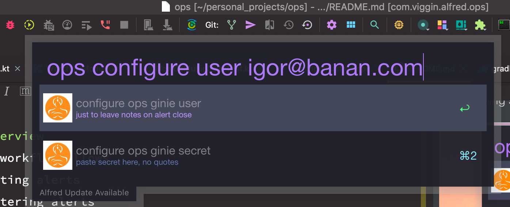

# Ops Ginie alfred client
---
## overview
this workflow allows
- listing alerts
- filtering alerts
- closing a single alert
    - a note with your user name telling alert was closed will be created
- closing all alerts like this ( using Levinshtein distance to close alerts which are similar to the selected alert)
- ack an alert
- opening selected alert in browser


## configuration
in order to use the workflow three parameters
- ops ginie user
    - example igor@banana.com
    - 
- ops ginie secret (api key)
    - [ops ginie keys configuration](https://docs.opsgenie.com/docs/api-key-management)
- ops ginie query
    - example 
    ```
    (status: open AND teams: ("banana" OR "banana_counting")) OR (status: open AND owner: (igor@banana.com OR boris@banana.com ))
    ```
    [using ops ginie query language](https://docs.opsgenie.com/docs/alerts-search-query-help)


## backlog
- assigning an alert
- selecting user basing on existing ops ginie users
 