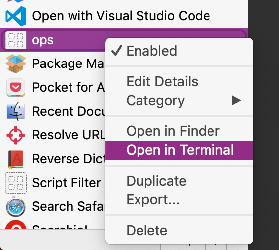

Ops Ginie alfred client
---

[](https://circleci.com/gh/viggin543/alfred-ops-ginie-workflow)

## overview
this workflow allows
- listing alerts
- filtering alerts
- closing a single alert
    - a note with your user name telling alert was closed will be created
- closing all alerts like this ( using Levinshtein distance to close alerts which are similar to the selected alert)
- ack an alert
- copying alert url to clipboard
- opening selected alert in browser


## dependencies
- jdk11
     - make sure `/usr/libexec/java_home -v 11` prints `/Library/Java/JavaVirtualMachines/jdk-11.0.2.jdk/Contents/Home`
     ( or any other directory with the jdk )

## configuration
in order to use the workflow three parameters
- ops ginie user
    - example igor@banana.com
    - 
- ops ginie secret (api key)
    - [ops ginie keys configuration](https://docs.opsgenie.com/docs/api-key-management)
    
- ops ginie query
    - example 
    ```
    (status: open AND teams: ("banana" OR "banana_counting")) OR (status: open AND owner: (igor@banana.com OR boris@banana.com ))
    ```
    
    [using ops ginie query language](https://docs.opsgenie.com/docs/alerts-search-query-help)

---
### listing alerts

selecting an alert and pressing `tab` will filter out other alerts 

### filtering alserts

this filtered out all alerts that does not contain `banana` in their message

### opening alert in browser
select an alert and press enter

### copy alert url to clipboard
select url and press `ctrl-c`

### close alert
select alert -  press `cmd` and press then `enter`
### close similar alerts
in case you have a ton of alerts with almost the same name
this can happen if every instance fires and alert and you have many instances
(its a bad sign and better refactor the alert mechanism to send the alert only once)

select alert, press `shift` and then enter.
this will close all the alerts that have a Levinshein distance < 8 from the alert you selected

### ack alert
select alert, press `option` and then enter


### logging
workflow writes his logs to `workflow.log`
in workflow work dir


## backlog
- assigning an alert
- selecting user basing on existing ops ginie users
 
 
 ## maintenance
 domrevigor@gmail.com
 